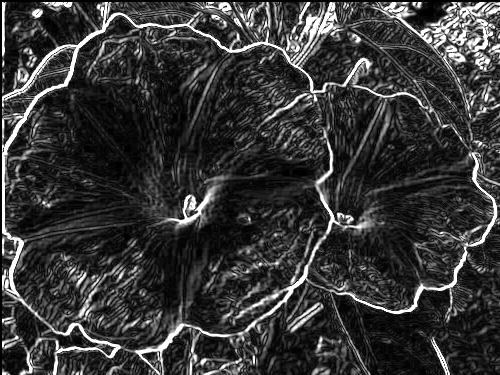

# Sobel Edge Detection Hardware Accelerator

## Overview
This project implements a streaming Sobel edge detection accelerator in Verilog and simulates it using Verilator and C++.

The design mimics real hardware image processing by using:
- Two line buffers
- A 3×3 sliding window
- Streaming pixel input (one pixel per clock cycle)
- Sobel gradient calculation: |Gx| + |Gy|

This system supports arbitrary image sizes (up to 4096 pixels in width).

---

## How it works
1. Images are placed in `images_in/`
2. They get converted to grayscale ASCII PGM format
3. Pixels are streamed into the Verilog Sobel module
4. Edge detection is computed in hardware simulation
5. Results are written to `images_out/`



---

## Architecture

- **Line Buffers** store the previous two rows
- **Shift Registers** form the 3×3 convolution window
- Sobel kernels compute horizontal and vertical gradients
- Output is clamped to 8-bit grayscale

---

### How to use
### 1. Install Dependencies

This project requires:

- **Verilator**
- **g++**
- **make**
- **ImageMagick** (for image conversion)

On Ubuntu/Debian:

```bash
sudo apt update
sudo apt install verilator g++ make imagemagick
```
Verify installation:
```
verilator --version
convert --version
```

### 2. Clone repository
```
git clone https://github.com/yaman-a/sobel-accelerator.git
cd sobel-accelerator
```

### 3. Add input images
Place any images (PNG, JPG, etc.) inside:
```
images_in/
```
Images can be any size up to 4096 pixels in width. They will automatically be:
- Converted to grayscale
- Converted to ASCII PGM format
- Processed by the Sobel hardware module

### 4. Build and run
Simply run:
```
make
```
This will:
1. Compile the Verilog Sobel module using Verilator
2. Build the C++ simulation executable
3. Convert input images to grayscale PGM
4. Run Sobel edge detection
5. Export results to images_out/

### 5. View results
Processed images will appear in 
```
images_out/
```
Each output field will have `_sobel` appended to its name.
