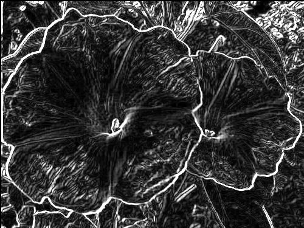
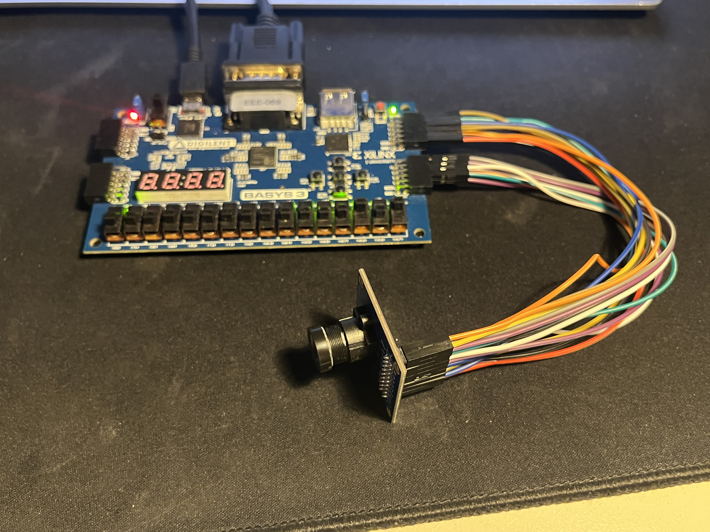
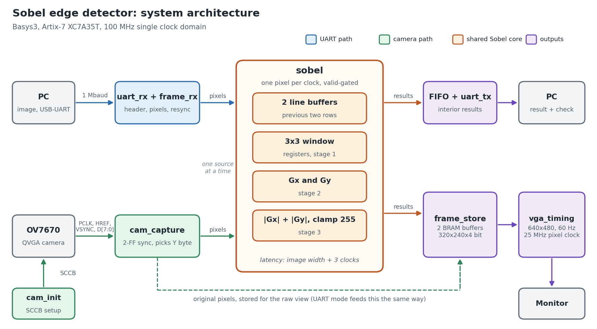
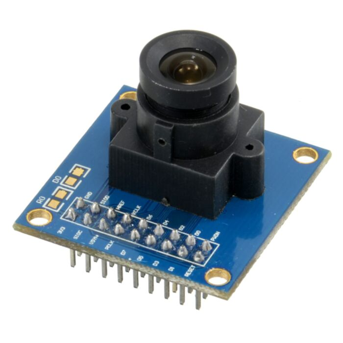

# Streaming Sobel edge detector on FPGA

A fully pipelined 3x3 Sobel edge detector in SystemVerilog, built up in stages from a Verilator
simulation to live video: an OV7670 camera feeds the filter and the result is shown on a VGA
monitor, all on a Digilent Basys3 (Artix-7 XC7A35T).






## What it does

| Stage | Input | Output | Status |
|-------|-------|--------|--------|
| 1. Simulation | PGM images | PGM images | Verilator testbenches, checked against a software model |
| 2. UART | Image from a PC (1 Mbaud) | Sobel result back to the PC | Hardware result matches the software Sobel exactly |
| 3. VGA | Image over UART | Original and Sobel on a monitor | Working on hardware |
| 4. Live camera | OV7670 (QVGA) | Live Sobel on a monitor | Working on hardware |

The live design has three views, chosen with switches `sw[1:0]`:

- Sobel output at 2x (640x480 from the 320x240 frame)
- Raw greyscale at 2x
- Raw and Sobel side by side at 1x

## The Sobel core (`rtl/sobel.sv`)

The filter takes one pixel per clock and produces one result per clock. For each 3x3 window it
computes `|Gx| + |Gy|` and clamps the result to 255.

- **Line buffers:** two line buffers hold the previous two rows, so each pixel is read from the
  input only once. `WIDTH` sets the maximum buffer depth. The actual image width is a runtime
  input (`image_width`), so one build handles any width up to `WIDTH`.
- **Pipeline:** three stages after the window is formed. Latency is one line plus 3 clocks.
- **Valid-gated:** the pipeline advances only when a valid pixel arrives, so gaps between lines
  (as in camera and VGA timing) are fine.
- **Output:** only interior pixels are produced, so a W x H image gives (W-2) x (H-2) results.

## Architecture



| File | Role |
|------|------|
| `rtl/sobel.sv` | Streaming 3x3 Sobel core |
| `rtl/uart_rx.sv`, `uart_tx.sv`, `fifo_sync.sv` | UART link and result FIFO |
| `rtl/frame_rx.sv` | Header, pixel and flush state machine, with idle-timeout resync |
| `rtl/sobel_uart_top.sv` | UART-only top level |
| `rtl/vga_timing.sv`, `frame_buf.sv`, `frame_store.sv` | 640x480 timing and the two frame buffers |
| `rtl/sobel_vga_top.sv` | UART in, VGA out |
| `rtl/sccb_master.sv`, `cam_init.sv` | Camera control bus and register setup |
| `rtl/cam_capture.sv`, `cam_frame_ctl.sv` | Camera pixel capture and frame control |
| `rtl/sobel_cam_core.sv`, `sobel_cam_top.sv` | Live camera design (core and pin-level top) |

## Design decisions

- **No second clock domain for the camera.** The camera's pixel clock (about 6 MHz at QVGA)
  is sampled by the 100 MHz system clock through two flip-flops, and a rising edge is detected
  from the synchronised copy. The data bus goes through the same two flip-flops, so it is
  sampled at the same instant as the clock. The data is stable for tens of nanoseconds around
  the edge, so this is safe, and the whole design stays in one clock domain with no
  clock-crossing logic.
- **Frame buffers between the filter and the display.** The camera and the monitor run at
  different rates, so the Sobel output is written to a BRAM frame buffer and VGA reads it at its
  own pace. Display gain is applied at read-out (4x, saturating) because Sobel values on natural
  images are small.
- **Reduced-size video.** 320x240 at 4 bits per pixel needs 12 RAMB36 per buffer, so both
  buffers fit comfortably on the XC7A35T.
- **Runtime image width.** Keeps the core reusable across the UART images and the camera
  without rebuilding.
- **Brightness control.** The OV7670's power-on exposure and gain defaults are too aggressive
  indoors, so `cam_init` lowers the AGC ceiling, the auto-exposure target and the brightness
  offset. `sw[3]` selects an extra-dark profile when the camera is configured.

## Verification

All testbenches are self-checking and run in Verilator 5 (`--binary --timing`).

| Target | What it checks |
|--------|----------------|
| `make test` | Sobel core against a software model on generated patterns (31 checks) |
| `make uart_test` | The UART design against bit-level UART models, including bad headers, resync and error flags (28 checks) |
| `make vga_test` | VGA timing: frame period, sync widths, visible pixel count |
| `make svga_test` | UART in to VGA out, comparing the captured frame to the expected image (9 checks) |
| `make cam_test` | A behavioural OV7670 drives the camera design; checks register writes, protocol, byte order, and the final frame buffers and VGA output (15 checks) |

To make sure the tests can actually fail, I injected bugs into the RTL by hand (for example
dropping a pipeline register, ignoring valid, changing the flush length, mangling the UART stop
bit) and checked that the testbenches caught each one. Mutants that slipped through exposed weak
checks, which I then strengthened. This was a manual process, not a script in the repo.

On hardware, the UART path returned a result identical to the software Sobel for every pixel.

## Results

Post-implementation numbers for `sobel_cam_top` (the full camera design) from Vivado 2026.1.

| Metric | Value |
|--------|-------|
| Device | XC7A35T-1CPG236 (Basys3) |
| System clock | 100 MHz (10 ns) |
| Setup slack (WNS) | +2.409 ns |
| Hold slack (WHS) | +0.082 ns |
| Pulse width slack (WPWS) | +3.750 ns |
| Timing | All user-specified constraints met, 0 failing endpoints (2406 checked) |
| Slice LUTs | 500 of 20,800 (460 logic, 40 as distributed RAM) |
| Slice registers | 473 of 41,600 |
| Block RAM | 24.5 of 50 tiles (24 RAMB36 + 1 RAMB18) |
| DSP48 | 1 of 90 (the multiplier for the start-up delay timer in `cam_init`) |
| Bonded IO | 53 of 106 |
| Sobel throughput | 1 pixel per clock (100 Mpixel/s at 100 MHz) |
| Sobel latency | image width + 3 clocks |
| VGA | 640x480, 25 MHz pixel rate, 59.5 Hz |

The design uses about 2.4% of the LUTs and about half of the block RAM, almost all of it the two
frame buffers. A setup slack of 2.4 ns at 10 ns means the longest path is about 7.6 ns, so the
logic has headroom beyond 100 MHz, though the board's clock and the VGA and camera timing are all
derived from 100 MHz.

## Running the simulations

You only need a PC for this part. Install the tools (Ubuntu/Debian):

```
sudo apt update
sudo apt install verilator g++ make imagemagick
verilator --version      # Verilator 5 or newer for the SystemVerilog testbenches
```

ImageMagick (`convert`) is needed only for the image targets. Then:

```
git clone https://github.com/yaman-a/sobel-accelerator.git
cd sobel-accelerator
```

**Run an image through the filter.** Put any images (PNG, JPG, ...) in `images_in/` and run:

```
make              # C++ testbench flow
make process_sv   # same images, using the SystemVerilog testbench instead
```

Each image is converted to greyscale ASCII PGM, streamed through the Sobel module one pixel
per clock, and the result is written to `images_out/<name>_sobel.png`.

**Run the regression tests.** Each target is self-checking and prints `ALL TESTS PASSED`:

```
make test         # Sobel core
make uart_test    # UART design
make vga_test     # VGA timing
make svga_test    # UART + VGA
make cam_test     # camera design (about 30 s)
```

To push one picture through the simulated UART design: `make uart_img IMG=images_in/photo.jpg`.

## Building for the Basys3

Vivado 2026.1 (earlier versions should work). Create an RTL project for part
`xc7a35tcpg236-1` and pick the top level and constraints for the stage you want:

| Stage | Top module | Constraints |
|-------|-----------|-------------|
| UART | `sobel_uart_top` | `constraints/basys3_uart.xdc` |
| UART + VGA | `sobel_vga_top` | `constraints/basys3_sobel_vga.xdc` |
| Live camera | `sobel_cam_top` | `constraints/basys3_cam.xdc` |

Add every file in `rtl/`. Check that the synthesis log shows 0 critical warnings; a constraints
file that did not load shows up as "No constraint files found".

### UART demo

```
pip install pyserial numpy pillow
python tools/fpga_sobel.py photo.jpg --port COM5
```

The script sends the image (8N1, 1 Mbaud, 2-byte width and height header), receives the
interior Sobel result, saves a PNG and compares every pixel with a software Sobel.
`tools/mock_fpga.py` is a software stand-in for the board, for trying the script without one.

### Camera wiring (OV7670, no FIFO module)



Use male-to-female jumpers; the Pmod sockets are female.

| Camera pin | Basys3 | Pin |
|------------|--------|-----|
| D0..D7 | JC | K17, M18, N17, P18, L17, M19, P17, R18 |
| VSYNC | JB | A14 |
| HREF | JB | A16 |
| PCLK | JB | B15 |
| XCLK | JB | B16 |
| SCL | JB | A15 |
| SDA | JB | A17 |
| RESET | JB | C15 |
| PWDN | JB | C16 |
| 3.3V, GND | any Pmod 3V3 and GND |  |

SDA uses the FPGA's internal pull-up; no external resistors were needed. Loose jumpers cause
flicker and byte-order glitches, so tape the connectors or fix the camera in place.

### Switches and LEDs (camera design)

| Control | Function |
|---------|----------|
| `btnC` | Reset and reconfigure the camera |
| `sw[1:0]` | View: `00` Sobel 2x, `01` raw 2x, `10` or `11` side by side at 1x |
| `sw[2]` | Swap the byte phase (Y byte selection) |
| `sw[3]` | Extra-dark exposure profile (read at reset) |
| `sw[4]` | Camera colour-bar test pattern (read at reset) |
| LD0 | Camera configured |
| LD1 | A camera register write was not acknowledged |
| LD2 / LD3 / LD4 | PCLK / HREF / VSYNC seen |
| LD5 | Frame toggle |
| LD15 | Heartbeat |

Bring-up order that worked: test pattern first (`sw[4]` up, `sw[1:0]`=`01`, press `btnC`), then
live video (`sw[4]` down, press `btnC`).

## License

MIT, see `LICENSE`.